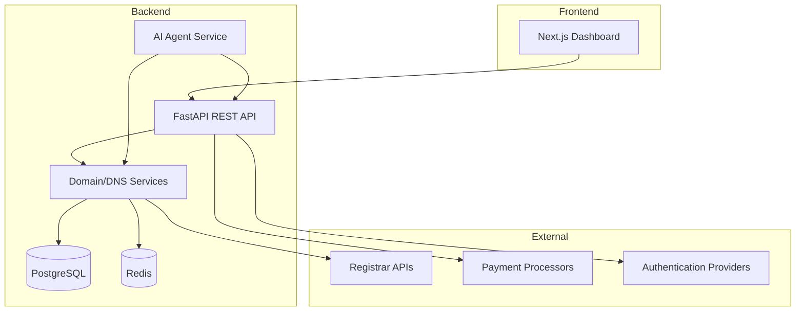

# Introduction

OpenDomain is an open-source domain registrar platform with an integrated AI agent, built for developers who want full control over their domain management workflow.

## Key Features

- **Complete Domain Management**: Register, renew, transfer, and manage domains with support for WHOIS privacy, DNSSEC, and multi-year registrations
- **AI-Powered Agent**: Claude-powered agent with natural language control for all platform actions
- **Self-Hostable**: Run on your own infrastructure or use Docker Compose for local development
- **REST API**: Comprehensive API for automation and integration
- **Command Line Interface**: Full-featured CLI for terminal-based domain management
- **Dashboard**: Modern web interface with real-time monitoring and analytics
- **Marketplace**: Domain marketplace for buying and selling domains
- **SSL Management**: Automated SSL certificate management

## Architecture

OpenDomain follows a modern microservices architecture:

## Technology Stack

### Backend
- **API Framework**: FastAPI (Python 3.12+)
- **Database**: PostgreSQL 16 with async SQLAlchemy
- **Cache**: Redis 7+ for sessions and caching
- **Authentication**: JWT with MFA support
- **AI Integration**: Claude API for agent functionality
- **Worker**: Celery for background tasks
- **DNS Management**: dnspython for DNS operations

### Frontend
- **Framework**: Next.js 15 with App Router
- **Language**: TypeScript
- **Styling**: Tailwind CSS + shadcn/ui components
- **State Management**: React Query (TanStack Query)
- **UI Components**: Custom component library

### Infrastructure
- **Containerization**: Docker Compose for local development
- **Proxy**: Caddy for automatic SSL certificate management
- **Cloud**: Vultr VPS deployment ready
- **CI/CD**: GitHub Actions workflows
Any provider that supports Docker
- **Monitoring**: Built-in uptime monitoring and alerting

## Use Cases

### For Individuals
- Manage personal domain portfolio
- Automated renewals and WHOIS privacy
- Domain watching and availability alerts
- AI assistant for domain suggestions

### For Businesses
- Multi-user team management
- Domain portfolio analytics
- Business identity protection
- Transfer management for acquisitions

### For Developers
- API-first domain management
- Integration with CI/CD pipelines
- Custom domain automation
- Self-hosted registrar capabilities

## Get Started

Choose your path:

- **[Quick Start](/getting-started/quick-start)**: Deploy with Docker Compose in minutes
- **[API Reference](/api)**: Explore the REST API endpoints
- **[CLI Guide](/cli)**: Learn command-line domain management
- **[Deployment Guide](/deployment)**: Deploy to production infrastructure

## License

OpenDomain is MIT licensed. You are free to use, modify, and distribute the software according to the terms of the license.

## Contributing

We welcome contributions! See our [Contributing Guide](https://github.com/etherealarchitect/OpenDomain/blob/main/CONTRIBUTING.md) for details on how to get involved.